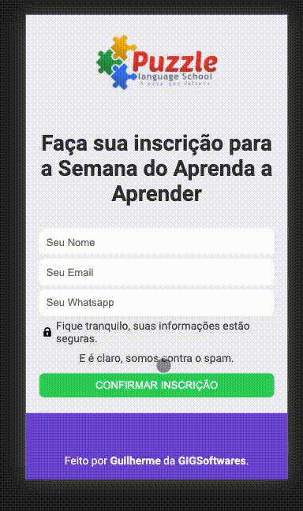
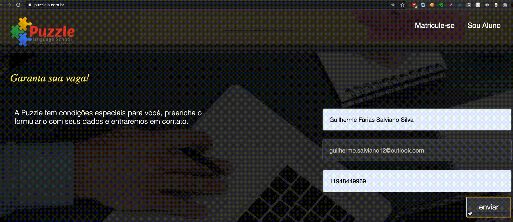
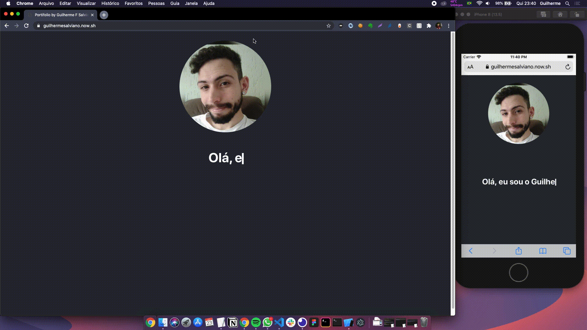

# Estes são alguns Projetos que já realizei
- 📈 Plataforma completa da Alpha Life Bureau com ReactJs, NodeJs e Redux.

- 🧩 Puzzle Language School - Escola de inglês online.
  - Desenvolvimento de uma página para inscrição no conjunto de aulas grátis - Tecnologias utilizadas: ReactJs.
  
  
  - Desenvolvimento de uma página para venda do curso - Tecnologias utilizadas: ReactJs.       
  
  
  - Integração Site X Mailchimp para disparo de emails automáticos - Tecnologias utilizadas: JQuery.
  

- <a target="_blank" href="https://guilhermesalviano.now.sh/">Portifólio pessoal</a> - Tecnologias utilizadas: ReactJs.

- 💈 <a target="_blank" href="https://studio-elimar-farias.now.sh/">Studio Elimar Farias - Site institucional para Salão de Beleza - Tecnologias utilizadas: ReactJs.</a>.

- 📝 <a target="_blank" href="https://github.com/Guibs1/mensseger-copy">Messenger Copy - React native e Typescript</a>

- ♻️ <a target="_blank" href="https://github.com/Guibs1/semana-next-level1">Ecoleta - Semana next level 1 - typescript, react e react-native</a>. ----

- <a target="_blank" href="https://github.com/Guibs1/to-be-hero">Semana Omnistack 11 - desenvolvimento de uma aplicação Web e Mobile com nodejs, reactjs e react native</a>.

<!-- Upload de arquivos - local e aws-s3 com nodejs - <a target="_blank" href="https://github.com/Guibs1/upload-files-nodejs-react">Ver</a>.-->

- 🎮 Jogo simples com Unity

- Audiunt - Projeto privado - Plataforma de ensino(e app mobile) para aprendizado por video aulas e realização de exercícios: futura demo

- <a target="_blank" href="https://github.com/Guibs1/TCC-Etec-2017/">TCC 2017 - GMG System - Projeto pausado - Controle de estoque utilizando Java SE Desktop</a>.
